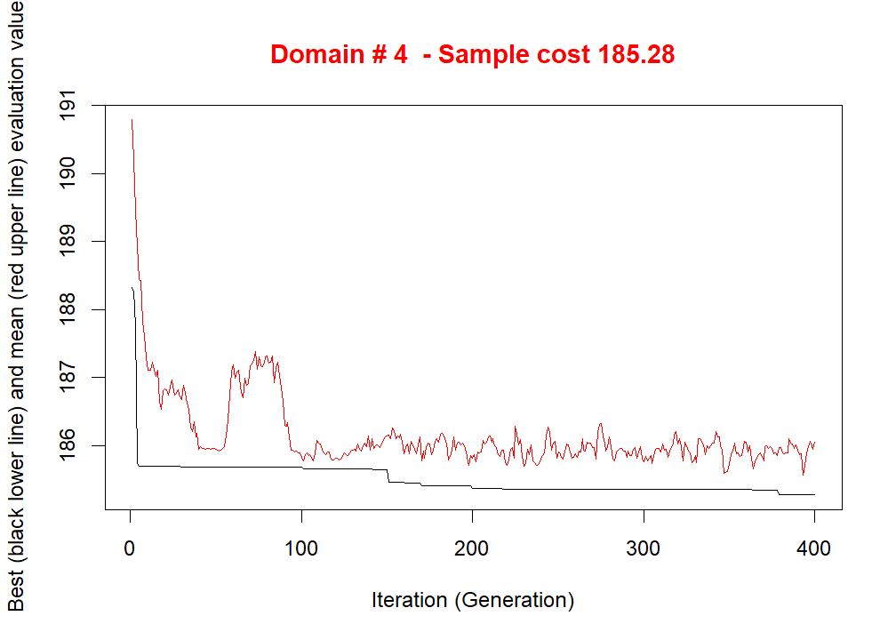
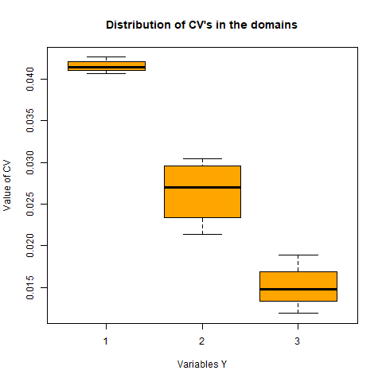

```{r setup, include=FALSE}
knitr::opts_chunk$set(echo = TRUE)

##### Dependencies #####
library(SamplingStrata)
library(stratification)
library(tidyverse) #load dependencies
library(BAMMtools) #jenks
library(grid) #to make grobs
library(gridExtra) # to make multiple plots
library(readr)


##### Resources: ####
# https://www.istat.it/it/files/2014/06/SamplingStrata-An-R-Package-for-the-Optimization-of-Stratified-Sampling.pdf
```

```{r Data Preparation}

#### Load in Data ####
# real data
econ3 <- read.csv("../Datasets/econ3.csv", header =T, na.strings = "")
econ4<- read.csv("../Datasets/pop_weighted_characteristics.csv", header = T, na.strings = "")


#practice data
data("swissmunicipalities", package = "sampling")

### for pop_weighted_characteristics
##### Filter Data ####
#Count each fee code category
econ4 %>% 
  group_by(Fee.Code) %>% 
  summarize(n())

## filter data ##
econ4 <- econ4 %>% 
  filter(Service.Connections <10000) %>% #filter above 2 because there are many
  filter(Fee.Code !="WH") %>%  #filter out wholesalers 
  filter(Fee.Code !="N1") %>% #transient non-community water systems
  filter(Fee.Code !="N2") %>%  #transient non-community water systems (handwash exemption)
  filter(Fee.Code != "SP") #nonTransient-NonCommunity water system


#re-count groups
econ4 %>% 
  group_by(Fee.Code) %>% 
  summarize(n())

#determine mean and stdev
econ4 %>% 
  summarize(mean = mean(Service.Connections),
            var = var(Service.Connections))

#replace $ and comma with blank "" 
econ4$Median_12month_HH_Income2 = as.numeric(gsub("[\\$,]", "", econ4$Median_12month_HH_Income))

num <- c(1, 2, 3, 4)
# convert fee code to integer
econ4 <-as_tibble(econ4) %>% 
  mutate(fee.code = case_when(
    Fee.Code == "C1" ~num[1],
    Fee.Code == "DAVCL" ~num[2],
    Fee.Code == "DAVCS" ~num[3],
    Fee.Code == "SC" ~num[4]))

    
##save data table as csv
write.csv(econ4, "../Datasets/econ5.csv")
```


# Determine the atomic strata (Cartesian product of the auxiliary information - i.e. service connections)
## usually too difficult to do. Another way is to explosre the space of partitions with the genetic algorithm using r Package SamplingStrata


```{r load data}

### First, we define the identifier of the frame. IN the case of the Swiss dataset, this is the municipality name. There are 7 municipalities (nominal values), for which we want to compare. $Nom

# # Practice Data
# frame <- NULL
# frame$id <- swissmunicipalities$Nom

### Real Data
frame2 <- NULL
frame2$id <- econ4$Water.System.Name

#Let us suppose to plan a survey whose target estimates are the totals of the population by
#age class in each Swiss region. In this case, the Y ’s variables will be:
#Y1: number of men and women aged between 0 and 19,
# Y2: number of men and women aged between 20 and 39,
# Y3: number of men and women aged between 40 and 64,
# Y4: number of men and women aged 65 and over.
# Consequently, the following statements are executed:
# frame$Y1 <- swissmunicipalities$Pop020
# frame$Y2 <- swissmunicipalities$Pop2040
# frame$Y3 <- swissmunicipalities$Pop4065
# frame$Y4 <- swissmunicipalities$Pop65P

## in the swiss data example, these values have been derived from a past survey (census or otherwise)

## not sure about this for our dataset quite yet,but it's optional
frame2$Y1 <- econ4$CES.3.0.Score
frame2$Y2 <- econ4$Median_12month_HH_Income2
frame2$Y3 <- econ4$Median_rent_pct_Income


####Define auxiliary variables (X)
#### Convert continuous variables into categorical using k-means clustering (function = var.bin)
#### Define M auxiliary variables
library("SamplingStrata")
set.seed(1508)
#practice dataset
frame$X1 <- var.bin(swissmunicipalities$POPTOT, bins = 18)
frame$X2 <- var.bin(swissmunicipalities$Surfacesbois, bins = 3)
frame$X3 <- var.bin(swissmunicipalities$Surfacescult, bins = 3)
frame$X4 <- var.bin(swissmunicipalities$Alp, bins = 3)
frame$X5 <- var.bin(swissmunicipalities$Airbat, bins = 3)
frame$X6 <- var.bin(swissmunicipalities$Airind, bins = 3)

# Real dataset
#frame2$X1 <- var.bin(econ4$Population, bins = 18)
frame2$X2 <- var.bin(econ4$Service.Connections, bins = 4)
# frame2$X3 <- var.bin(econ4$Max.TP.Class, bins = 9) #may use this in the future
summary(frame2$X2)

### set the values of the domainvalue variable (in this case, estimates for the seven regions $REG)
#frame$domainvalue <- swissmunicipalities$REG
#frame <- as.data.frame(frame)
#head(frame)

#real data (Fee code?)
frame2$domainvalue <- econ4$fee.code #note that fee.code has been arbitrarily recharacterized as numbers
frame2 <- as.data.frame(frame2)
head(frame2)
```

##### Construction of atomic strata #####
# 1. the identifier of the stratum (named STRATO), concatenation of the values of the variables
# X’s;
# 2. the values of the M auxiliary variables (named X1 to XM ) corresponding to those in the
# frame;
# 3. the total number of units in the population belonging to the stratum (named N);
# 4. a flag (named CENS) indicating if the stratum is to be censused (= 1) or sampled (= 0);
# 5. a variable indicating the cost of interviewing a single unit in the stratum (named COST);
# 6. for each target variable Y , its estimated mean and standard deviation (named respectively Mi and Si);
# 7. the value of the domain of interest to which the stratum belongs (named DOM1 and corresponding to the variable domainvalue in the frame data frame).


```{r Construction of atomic strata}
### if all values are present, buildStrataDF can auto generate strata
#practice data
#strata <- buildStrataDF(frame)
#str(strata)

#Real data
strata2 <- buildStrataDF(frame2)
str(strata2)
```

 It is worth noting that the total number of different atomic strata is lower than the expected
 dimension of the Cartesian product of the X’s (which is 4,374): this is due to the fact that
 not all combinations of the value of the auxiliary variables are present in the sampling frame.

Variables COST and CENS are initialized to 1 and 0, respectively, for all strata. It is possible
to give them different values:
 1. for variable COST, it is possible to differentiate the cost of interviewing per unit by
 assigning real values;
 2. for variable CENS, it is possible to set it equal to 1 for all strata that are of the ‘take-all’
 type (i.e., all units in those strata must be selected).

On the contrary, if there is no information in the frame regarding the target variables, it is
necessary to build the strata data frame starting from other sources, for instance a previous round of the same survey, or from other surveys.

```{r Choose Precision Constraints for each target estimate}
####### Choice of precision constraints for each target estimate ######
## Note that G target variables (y) are optional, but improve survey design.
# pracice data
#cv <- data.frame(DOM = "DOM1", CV1 = 0.05, CV2 = 0.05, CV3 = 0.05, CV4 = 0.05, domainvalue = 1:7)
#cv

# real data. Note that CVs should be set to each response value (Y)
cv2 <- data.frame(DOM = "DOM1", CV1 = 0.04, CV2 = 0.04, CV3 = 0.04, domainvalue = 1:4)
cv2

# In this way, we have set a maximum of 5% to the coefficients of variation expected for variables
# Y1, Y2, Y3 and Y4, in each of the 7 different domains (Swiss regions) in domain level DOM1.
# Of course we could differentiate the precision constraints region by region. It is important to
# underline that the values of domainvalue are the same than those in the frame data frame,
# and correspond to the values of variable DOM1 in the strata data frame

# If we want to determine the total size of the sample required to satisfy these precision constraints, considering the current stratification of the frame (the 641 atomic strata), we can do
# this by simply using the function bethel (it is worth noting that the format of the constraints
#data frame for the bethel function is different from the one accepted by the optimizeStrata
#function, as in bethel it is not possible to differentiate precision levels in the various subdomains) :

## practice data
#errors <- cv[1, 1:5]
#allocation <- bethel(strata, errors)
#length(allocation)  
#sum(allocation)

## real data
errors2 <- cv2[1, 1:4]
allocation2 <- bethel(strata2, errors2)
length(allocation2)  

sum(allocation2)


# This is the required amount of units to be sampled when the frame stratification is most
# detailed. In general, after the optimization, this number is greatly reduced.
```


##### Optimization of frame stratification#####
# 1. cv: the (mandatory) data frame containing the precision levels expressed in terms
# of maximum acceptable coefficients of variation that refer to the estimates on target
# variables Y ’s of the survey;
# 2. strata: the (mandatory) data frame containing the information related to atomic strata;
# 3. initialStrata: the initial upper limit on the number of strata for each solution. Default value is nrow(strata), i.e., the number of atomic strata;
# 4. minnumstr: the minimum number of units that must be allocated in each stratum.
# Default is 2, that is the minimum value necessary to calculate sampling variance;
# 5. iter: the number of iterations (= generations) to be performed by the algorithm.
# Default is 20;
# 6. pops: the dimension of each generation in terms of individuals. Default is 50;
# 7. mut_chance (mutation chance): for each new individual, the probability that the value
# of a given chromosome (i.e., one bit in the solution vector), is changed. Default is 0.05;
# 8. elitism_rate: this parameter indicates the rate of fittest solutions that must be transferred from one generation to another. Default is 0.2.

```{r Optimization of frame stratification}

# ## practice data
# solution <- optimizeStrata(errors = cv, strata = strata, cens = NULL, 
#                            strcens = FALSE, addStrataFactor = 0.00,
#                            minnumstr = 2, iter = 400, pops = 20, mut_chance = 0.005, 
#                            elitism_rate = 0.2, highvalue = 1e+08, suggestions = NULL, 
#                            realAllocation = TRUE, writeFiles = TRUE) #initialStrata = nrow(strata) -default, not working for some reason
# 
# ## examine number of optimized strata 
# sum(ceiling(solution$aggr_strata$SOLUZ))

## real data
solution2 <- optimizeStrata(errors = cv2, strata = strata2, cens = NULL, 
                           strcens = FALSE, addStrataFactor = 0.00,
                           minnumstr = 2, iter = 400, pops = 20, mut_chance = 0.005, 
                           elitism_rate = 0.2, highvalue = 1e+08, suggestions = NULL, 
                           realAllocation = TRUE, writeFiles = TRUE) #initialStrata = nrow(strata) -default, ##note that multiple files are printed in "./output"

#Vector of indices indicating to what aggregated stratum each atomic stratum belongs
solution2$indices

#data frame containing information on the optimal aggregated strata
solution2$aggr_strata

## examine number of optimized strata 
sum(ceiling(solution2$aggr_strata$SOLUZ))

 #notice optimization in fourth bin (Fee.Code = SC; Small Community Systems)
```
It can be seen that there has been a noticeable reduction in the size of the sample (), compared
to the solution found in the case of atomic strata.
The execution of optimizeStrata implies an independent optimization in each one of the 7
different domains (regions): the optimization run for region 3 is reported in Figure 1.


##### 3.5. Analysis of results #####
In order to analyze how tomic strata have been aggregated, it is possible to apply the function updateStrata, that assigns the labels of the new strata to the initial ones in the data frame strata, and produces:

1. a new file named ‘newstrata.txt’ containing all the information in the strata data frame related to atomic strata, plus a label indicating to which new stratum a given atomic stratum belongs;

2. a table, contained in the file ‘strata aggregation.txt’, showing in which way the auxiliary variables X determine the new strata.

```{r Analysis of Results}
# #practice data
# newstrata <- updateStrata(strata, solution, writeFiles = TRUE)
# head(newstrata)

#real data
newstrata2 <- updateStrata(strata2, solution2, writeFiles = TRUE)
head(newstrata2)

# Now, the atomic strata are associated with the aggregate strata defined in the optimal solution, by means of the variable LABEL. If we want to analyze in detail the new structure of the
# stratification, we can look at the ‘strata_aggregation.txt’ file:

strata_aggregation <- read.delim("strata_aggregation.txt")
head(strata_aggregation)
```

In this structure, for each aggregate stratum the values of the X’s variables in each contributing atomic stratum are reported. It is then possible to understand the meaning of each aggregate stratum produced by the optimization.

##### 3.6. Updating the frame and selecting the sample #####

Once the optimal stratification has been obtained, to be operational we need to accomplish
the following two steps:
1. to update the frame units with new stratum labels (combination of the new values of the auxiliary variables X);
2. to select the sample from the frame stratified accordingly to the solution found.

```{r Updating the Frame and Selecting the Sample}
# To do the first, we execute the following command:
# 
# #practice data
# framenew <- updateFrame(frame, newstrata, writeFiles = TRUE)

#real data
framenew2 <- updateFrame(frame2, newstrata2, writeFiles = TRUE)
# The function updateFrame receives, as arguments, the indication of the data frame in which
# the frame information is saved, and of the data frame produced by the execution of the
# updateStrata function. The execution of this function produces a data frame (framenew),
# and also a file (named ‘framenew.txt’) containing, for each unit, the label indicating to which
# aggregated stratum the unit belongs. The allocation of units is contained in the SOLUZ variable
# in the data frame solution$aggr_strata. It is now possible to select the sample from this
# new version of the frame:

# #practice data
# sample <- selectSample(framenew, solution$aggr_strata, writeFiles = TRUE)

#real data data
sample2 <- selectSample(framenew2, solution2$aggr_strata, writeFiles = TRUE)

# The function selectSample produces two datasets:
# 1. ‘sample.csv’ containing the units of the frame that have been selected, together with the weights that have been calculated for each one of them;
# 2. ‘sample.chk.csv’ containing information on the selection: for each stratum, the number of units in the population, the planned sample, the number of selected units, the sum of their weights (that must equalise the number of units in the population).
```

###### 3.7. Evaluation of the found solution #####

In order to be confident about the quality of the found solution, the function evalSolution
allows to run a simulation, based on the selection of a desired number of samples from the
frame to which the stratification, identified as the best, has been applied.


```{r Evaluation of the Found Solution}
#The user can invoke this function also indicating the number of samples to be drawn:
# #practice data
# evalSolution(framenew, solution$aggr_strata, nsampl = 1000, writeFiles = TRUE)

#real data
evalSolution(framenew2, solution2$aggr_strata, nsampl = 1000, writeFiles = TRUE) ##note that this may not work in rMarkdown due to intrinsic paths. May need to run in console.

# For each drawn sample, the estimates related to the Y ’s are calculated. Their means and
# standard deviations are also computed, in order to produce the CV related to each variable
# in every domain. These Coefficient of Variation (CV’s) are written to an external CSV file:
expected_cv <- read.csv("./simulation/expected_cv.csv")
expected_cv


# These values are on average compliant with the precision constraints set (see also Figure 2).
```


The R package stratification (Baillargeon and Rivest 2012b) implements various methods in
order to choose strata boundaries and determine the best allocation in the univariate case,
i.e., in the case of only one stratification variable (and only one target variable, that can be
coincident with the stratification one), having set the number of strata. These methods are:
  * the cumulative root frequency method, proposed by Cochran (1977);
  * the geometric stratification method, introduced by Gunning and Horgan (2004);
  * the Lavall´ee and Hidiroglou (LH) stratification method (Lavall´ee and Hidiroglou 1988),
with two different optimization algorithms: Sethi’s algorithm (Sethi 1963) and Kozak’s
random search algorithm (Kozak 2004).


```{r 4. A comparative assessment of the GA method}
# The package contains a number of datasets, namely Debtors, UScities, UScolleges and
# USbanks. It is possible to apply to each dataset the different methods available in package stratification, together with the genetic algorithm in package SamplingStrata, and verify the
# performance of each of them. The goal is to minimize the total sample size n under a given
# constraint on the CV of the unique target variable. For instance, considering the dataset
# USbanks,
library("stratification")

## Practice data
data("USbanks", package = "stratification")
LHkozak <- strata.LH(x = USbanks, CV = 0.01, Ls = 5, alloc = c(0.5, 0, 0.5), takeall = 0, algo = "Kozak")
LHkozak

## Real data
LHkozak2 <- strata.LH(x = allocation2, CV = 0.01, Ls = 5, alloc = c(0.5, 0, 0.5), takeall = 0, algo = "Kozak")
LHkozak2

# The application of the LH method (making use of Kozak’s algorithm) yields a total sample
# size of 91. It is the best solution compared to the others obtained by applying the geometric
# and the cumulate root frequency. The results obtained by the different methods are reported
# in Table 1.
# We now apply the genetic algorithm to the same problem:

frame <- data.frame(Y1 = USbanks, X1 = rep(1:length(unique(USbanks)), table(USbanks)),domainvalue = rep(1, length(USBanks)))
frame$id <- row.names(frame)
strata <- buildStrataDF(frame)
strata <- strata[order(strata$X1), ]
cv <- data.frame(DOM = "DOM1", CV1 = 0.01, domainvalue = 1)
pop <- 20
z <- cut(strata$M1,quantile(strata$M1, probs = seq(0, 1, 0.2)), label = FALSE, include.lowest = TRUE)
v <- matrix(z, nrow = pop - 1, ncol = nrow(strata), byrow = TRUE)
solution <- optimizeStrata(cv, strata, cens = NULL, strcens = FALSE, alldomains = TRUE, dom = NULL, initialStrata = 5, addStrataFactor = 0.0, minnumstr = 2, iter = 10000, pops = pop, mut_chance = 0.0005, elitism_rate = 0.2, highvalue = 1e+08, suggestions = v, realAllocation = TRUE, writeFiles = TRUE)

#These are the resulting aggregated strata (graphically represented in Figure 3) :
solution$aggr_strata
sum(bethel(solution$aggr_strata, cv))
```


```{r Join Sample List to metadata}
feecode <- c("C1", "DAVCL", "DAVCS", "SC") #list to repopulate

sample3 <- left_join(x = sample2, y = econ4, by = c("ID" = "Water.System.Name")) %>% 
   select(!Median_12month_HH_Income)

SampleList <- sample3 %>% 
 # mutate(Fee.Code = case_when(
  #  DOMAINVALUE == "1" ~feecode[1],
   # DOMAINVALUE == "2" ~feecode[2],
    #DOMAINVALUE == "3" ~feecode[3],
  #  DOMAINVALUE == "4" ~feecode[4])) %>% 
  mutate(CES.3.0.Score = Y1) %>% 
  mutate(Median_12month_HH_Income = Y2) %>% 
  mutate(Median_rent_pct_Income = Y3) %>% 
  mutate(Population.Bin = X1) %>% 
  mutate(Service.Connections.Bin = X2) %>% 
  select(!Y1:X2) %>% 
  select(!DOMAINVALUE)

SampleList$Fee.Code <- as.factor(SampleList$Fee.Code)
SampleList$Service.Connections.Bin <- as.factor(SampleList$Service.Connections.Bin)
SampleList$Population.Bin <- as.factor(SampleList$Population.Bin)

## Determine bin breaks
SummaryStrataList <-SampleList %>% 
  group_by(Service.Connections.Bin) %>% 
  summarize(minServConn = min(Service.Connections), maxServConn = max(Service.Connections), count = n())
SummaryStrataList


breaks <- c(3, 1009, 3128, 6219, 9890)
tags <- c("Bin1", "Bin2", "Bin3", "Bin4")
#make data table from breaks
breaksdf <-tibble(log10(breaks))

#bucket values into bins
bins <- cut(SampleList$Service.Connections,
            breaks = breaks,
            include.lowest = TRUE,
            right = FALSE,
            labels = tags)


write.csv(SampleList,
          file = "SampleList.csv")
          #path = "Datasets/")
```

```{r Plot Sample List}
DAVCL<- filter(SampleList, Fee.Code =="DAVCL") %>% 
  ggplot(mapping = aes(x=Service.Connections, fill = LABEL)) + 
  geom_histogram(aes(y=..density..),alpha=0.7)+
  geom_density(alpha = 0.4) +
  labs(x='LOG10 Service Connections',
       y = "Density",
       title = "Disadvantaged Large Community Water Systems (Fee Code = DAVCL)",
       subtitle = "n = 124")

DAVCS<- filter(SampleList, Fee.Code =="DAVCS") %>% 
  ggplot(mapping = aes(x=log10(Service.Connections))) + 
  geom_histogram(aes(y=..density..),alpha=0.7, fill = tag)+
  geom_density(alpha = 0.4) +
  labs(x='LOG10 Service Connections',
       y = "Density",
       title = "Disadvantaged Community Water Systems (Fee Code = DAVCS)",
       subtitle = "n = 238")

C1<- filter(SampleList, Fee.Code =="C1") %>% 
  ggplot(mapping = aes(x=log10(Service.Connections), fill = tag)) + 
  geom_histogram(aes(y=..density..),alpha=0.7)+
  geom_density(alpha = 0.4) +
  labs(x='LOG10 Service Connections',
       y = "Density",
       title = "Large Community Water Systems (Fee Code = C1)",
       subtitle = "n = 327")

SC<- filter(SampleList, Fee.Code =="SC") %>% 
  ggplot(mapping = aes(x=log10(Service.Connections), fill = tag)) + 
  geom_histogram(aes(y=..density..),alpha=0.7)+
  geom_density(alpha = 0.4) +
  labs(x='LOG10 Service Connections',
       y = "Density",
       title = "Small Community Water Systems (Fee Code = SC)",
       subtitle = "n = 1700")

#all together
FeeCodeBin<- grid.arrange(DAVCL, DAVCS, C1, SC,
                          ncol =2,nrow= 2,
                          top = textGrob("Water Systems Fee Codes By Bin", gp=gpar(fontsize = 30, font=4)))

#Save
ggsave(path = "plots",
       filename = "FeeCodeGroupedByBins.png",
       FeeCodeBin,
       width = 10,
       scale = 2,
       dpi = 500)


FeeCodeDistributions <- sample3 %>% 
  ggplot(mapping = aes(x=log10(Service.Connections))) + 
  geom_histogram(aes(fill = Fee.Code), position = "identity",alpha=0.6, bins = 90) +
  labs(x='LOG10 Service Connections',
       y = "Count",
       title = "Fee Code Distributions",
       subtitle = "Genetically Optimized Strata shown in dotted lines")+
  scale_fill_discrete(name = "Fee Code", labels = c("Large Water System", "Disadvantaged Large Community Water System", "Disadvantaged Small Community Water System", "Small Community")) +
  geom_vline(data = breaksdf, mapping = aes(xintercept= log10(breaks)), linetype = 'dashed')

FeeCodeDistributions
```


If we compare the strata obtained by the best method in package stratification and the ones
obtained by the execution of optimizeStrata function in package SamplingStrata, we notice
they are almost the same except for very small differences (Table 2). In particular, the first
three strata are equal, the only difference is in the allocation equal to ‘10’ in the second
stratum, due to the rounding of the value 9.01 to the next upper integer.
The execution of all methods is repeated for each one of the four data frame, and related
results are reported in Table 3.
Analyzing these results, we can say that the results of the application of the genetic algorithm
are in general the second best after the LH method (with Kozak’s algorithm). We should remark, however, that the differences between the GA and LH methods are due to the rounding
rule (i.e., rounding to the next upper integer) of the GA method: without this penalization
the two methods would be practically equivalent.
In conclusion, the fact that the genetic algorithm method is able to reproduce the results
of consolidated methods in the univariate case, certifies its validity. In addition, it has to
be underlined that the GA is characterized by a general applicability to the multivariate
and multi-domain cases, while all the other methods are strictly limited to the univariate
single-domain case.


###### Goal: maximize precision levels under given budget constraints (400 samples) ####


##### Outline of Steps Required #####
# 1. analysis of the frame data: identification of available auxiliary information;
# 2. manipulation of auxiliary information: in case auxiliary variables are of continuous type,
# they have to be transformed into categorical variables;
# 3. construction of atomic strata: on the basis of the categorical auxiliary variables available
# in the sampling frame, the set of atomic strata can be obtained by cross-classifying the
# units by using all the values of all the auxiliary variables;
# 4. characterization of each atomic stratum with the information related to the target variables (mean and standard deviation for each Y , estimated by using available information: by census, previous surveys or proxy variables data);
# 5. choice of the precision constraints for each target estimate, possibly differentiated by
# domain;
# 6. optimization of stratification and determination of required sample size and allocation;
# 7. analysis of the resulting optimized strata;
# 8. association of new labels to sampling frame units, each of them indicating the new strata
# resulting from the optimal aggregation of the atomic strata;
# 9. selection of units from the sampling frame with a stratified random sample selection
# scheme;
# 10. analysis of the solution found.


